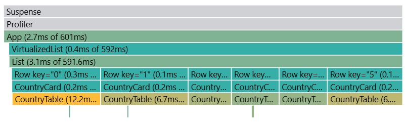
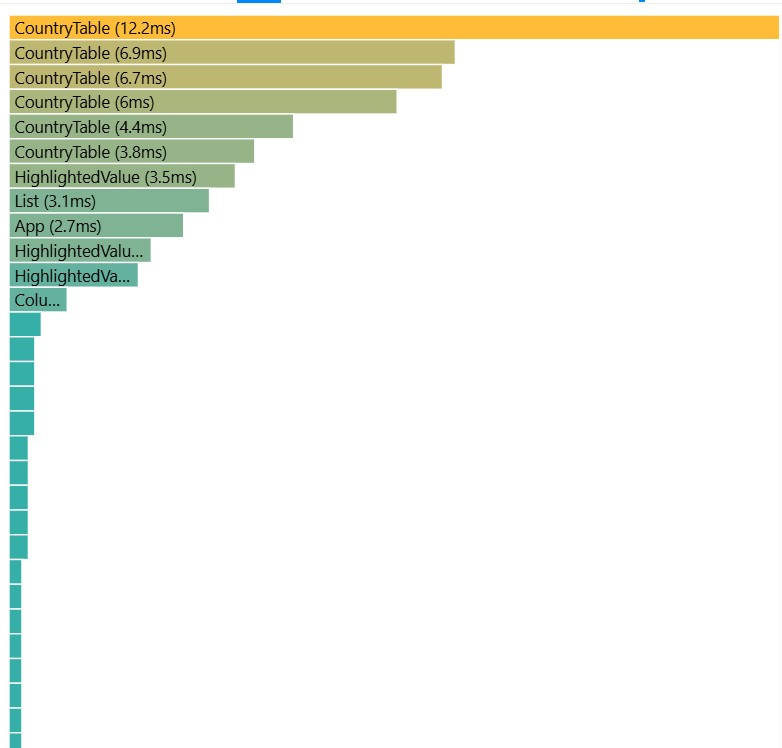
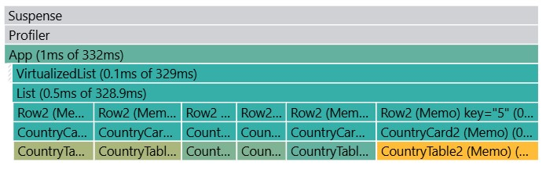
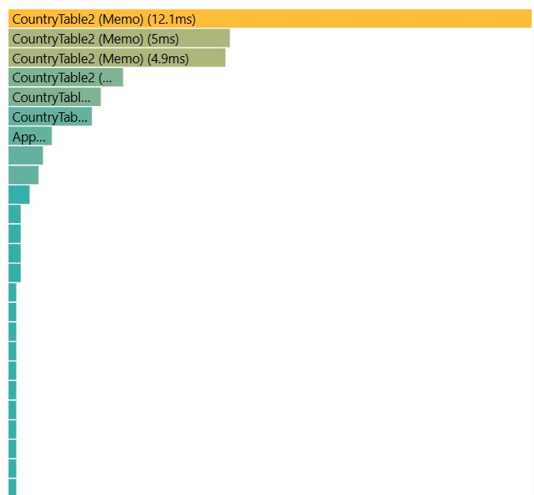

## Initial Performance Analysis (React Profiler)

Key interactions:
- Selecting another year
- Sorting by population
- Searching for a country
- Adding/removing columns

### Findings:
- **Commit Duration**: 601 ms for rendering updates.
- **Render Duration**: App (2.7 ms), VirtualizedList (0.4 ms), List (3.1 ms), CountryTable - 3.8–12.2 ms per render.
- **Interactions**: Year selection and column selection caused the largest updates, as expected.
- **Flame Graph**: Re-renders occur across CountryCard and especially CountryTable. Child components are re-rendered unnecessarily.
- **Ranked Chart**: CountryTable - the most expensive component, with up to 12.2 ms per render.

### Screenshots

## Update Performance Analysis (React Profiler)

Key interactions:
- Selecting another year
- Sorting by population
- Searching for a country
- Adding/removing columns

### Findings:
- **Commit Duration**: 332 ms for rendering updates.
- **Render Duration**: App (1 ms), VirtualizedList (0.1 ms), List (0.5 ms), but CountryTable took the most time (1.9-12.1 ms per render).
- **Interactions**: Year selection and column selection caused the largest updates, as expected.
- **Flame Graph**: Very few expensive commits — most are in the low millisecond range.
- **Ranked Chart**: Confirms CountryTable as the heaviest component, but it is far lighter than the old one.

### Screenshots

### Summary
Without memoization (memo, useMemo, useCallback), the application triggers more frequent and heavier re-renders, particularly in CountryTable.
Adding memo, useMemo, and useCallback reduced re-renders and improved performance by ~40–50%.
List and Row also show significantly higher render costs compared to the optimized case.